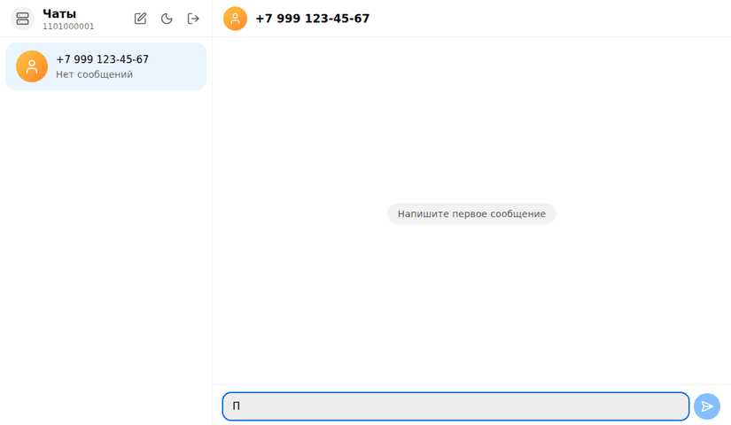

# MAX-чат — GREEN-API

<!-- OWNER — заменить на логин GitHub после публикации. -->

[](https://github.com/OWNER/green-api-max-chat/actions/workflows/ci.yml)

Веб-чат для отправки и получения текстовых сообщений в MAX через [GREEN-API](https://green-api.com/max).
Внешний вид — как у [web.max.ru](https://web.max.ru/). Тестовое задание «Фронтенд разработчик React».

**Демо:** https://dulcet-pixie-99bb64.netlify.app · **Скриншоты:** [docs/screenshots](docs/screenshots/)



## Что умеет

- Вход по `idInstance` + `apiTokenInstance` с проверкой статуса инстанса.
- Новый чат по номеру +7 / +375.
- Отправка (`sendMessage`) и получение (`receiveNotification` → `deleteNotification`) текстовых сообщений.
- Статусы «отправлено / доставлено / прочитано», непрочитанные, история после F5.
- Телефон и desktop, светлая и тёмная тема, работа с клавиатуры и скринридером.

Не делали (задание просит «максимально просто»): медиа, группы, реакции, редактирование, поиск.

## Быстрый старт

Нужен Node.js 22+.

```bash
git clone https://github.com/OWNER/green-api-max-chat.git
cd green-api-max-chat
npm ci
npm run dev                       # http://localhost:5173, нужен свой инстанс
VITE_API_MOCKS=true npm run dev   # без инстанса, на моках
```

**На моках** войдите с `idInstance` = `1101000001` и любым токеном. Другие окончания id и метки в тексте
сообщения (`#dup`, `#photo`, `#logout`…) включают разные сценарии — список в [src/mocks/README.md](src/mocks/README.md).

**С живым инстансом:** в [личном кабинете GREEN-API](https://console.green-api.com) создайте инстанс MAX,
авторизуйте его по QR-коду, оставьте **Webhook URL пустым** и включите уведомления о входящих, исходящих
и статусах. `apiUrl` инстанса вводится на экране входа в блоке «Дополнительно».

## Как устроено

Код разложен по слоям [Feature-Sliced Design](https://feature-sliced.design/): верхний слой может
импортировать только нижние.

```text
src/
  app/        запуск: роутер, провайдеры, старт фоновых сервисов
  pages/      страницы: вход, чаты — только собирают блоки
  widgets/    крупные блоки: список чатов, окно чата, баннеры
  features/   действия: вход, выход, новый чат, отправка, получение, история, вкладки
  entities/   данные: сессия, чат, сообщение, уведомление
  shared/     общее: API-клиент, UI-кнопки и поля, утилиты
  mocks/      моки GREEN-API для тестов и dev
```

Главное:

- **Получение** — фоновый цикл без React: взять событие → применить → удалить из очереди.
  При сбоях пауза растёт до 30 с; битое событие удаляется и не ломает цикл.
- **Без дублей:** сообщения склеиваются по `idMessage`, статус только растёт.
- **Отправка** — очередь по одному, «Повторить» не создаёт дубль.
- **Каждый ответ API проверяется** zod-схемой: неожиданный ответ — понятная ошибка, а не белый экран.
- **Состояние** — Zustand; запросы-мутации — TanStack Query.
- **Креды и история** — только в браузере (`sessionStorage` или `localStorage` с «Запомнить меня»).
- **Одна активная вкладка:** очередь событий одна на инстанс, поэтому работает последняя открытая вкладка,
  остальные показывают заглушку.

Стек: React 19, TypeScript, Vite, Tailwind поверх токенов дизайна, Radix UI, React Router, react-hook-form.

## Правила

Коротко — полностью в [docs/](docs/README.md):

- Слои FSD и направление импортов проверяет ESLint ([architecture](docs/architecture.md), [imports](docs/imports.md)).
- Компоненты в `ui/` только рисуют и получают данные пропсами; логика — в `model/` ([ui](docs/ui.md)).
- В JSX нет `&&` и тернарников (есть `<Gate>`), нет стрелок в обработчиках, нет `as` ([code-style](docs/code-style.md)).
- Цвета и размеры — только из токенов дизайна ([ui](docs/ui.md)).
- Работа с API, ошибки, фоновые сервисы — [data](docs/data.md).
- Коммиты — Conventional Commits, перед коммитом хук гонит ESLint, Prettier и поиск токенов ([workflow](docs/workflow.md)).
- Все тексты интерфейса собраны в [docs/copy.md](docs/copy.md) (генерируется: `npm run copy`).

## Как тестировать

```bash
npm test                  # unit и компонентные (Vitest + Testing Library), ~1 мин
npm run test:coverage     # то же с покрытием, порог 80 % на логику и API
npx playwright install chromium   # один раз
npm run test:e2e          # 8 сценариев в браузере на моках
npm run check             # всё перед коммитом: типы, линтер, формат, секреты, тесты
```

- Все автотесты идут на моках (MSW), живой инстанс не нужен.
- Тесты ищут элементы так же, как пользователь — по ролям и подписям.
- CI на каждый push: секреты → lint → типы → тесты → сборка → e2e.
- Демо собирает Netlify из `main` по [`netlify.toml`](netlify.toml); заголовки безопасности — `dist/_headers`.
- Проверка вручную на живом инстансе — чек-лист в [docs/testing.md](docs/testing.md#5-ручная-проверка-перед-сдачей).

## Ограничения

- Собеседник ищется только по номеру +7 или +375 — ограничение API.
- Бесплатный тариф GREEN-API — 3 собеседника в месяц.
- История живёт только в этом браузере.

## Автор

Залкар Маматкасымов · [zalkarrmm@gmail.com](mailto:zalkarrmm@gmail.com) ·
[LinkedIn](https://www.linkedin.com/in/zalkar-mamatkasymov/) · Telegram: _@ник_ · Лицензия [MIT](LICENSE)
